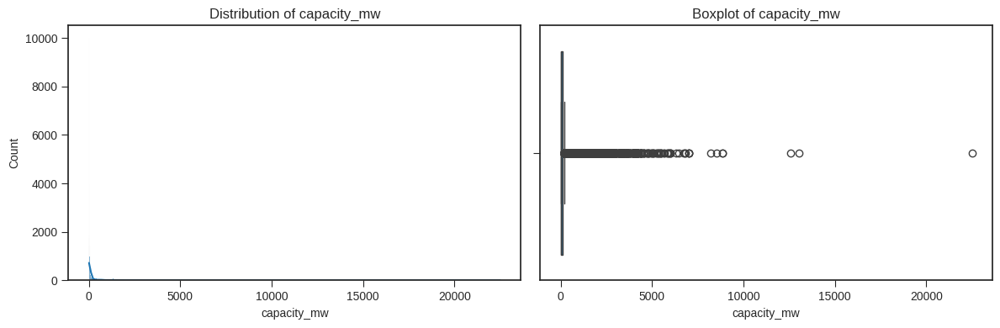
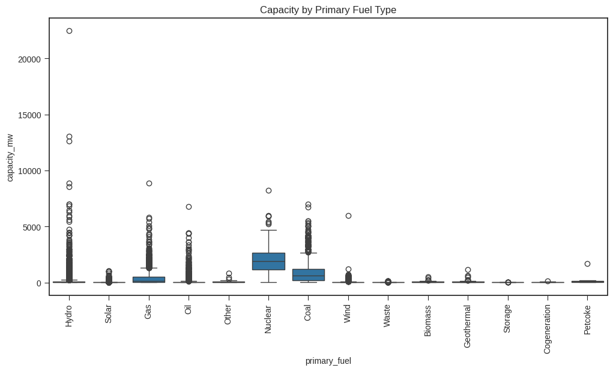
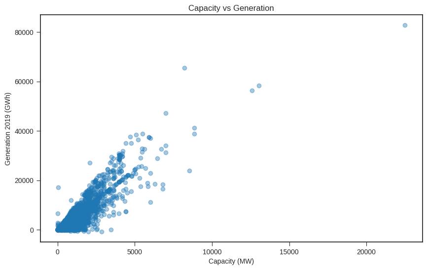
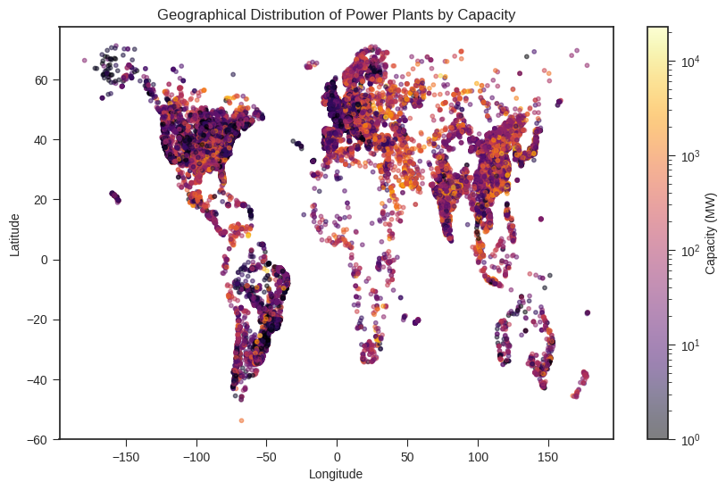
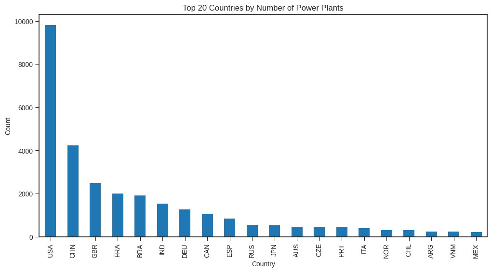
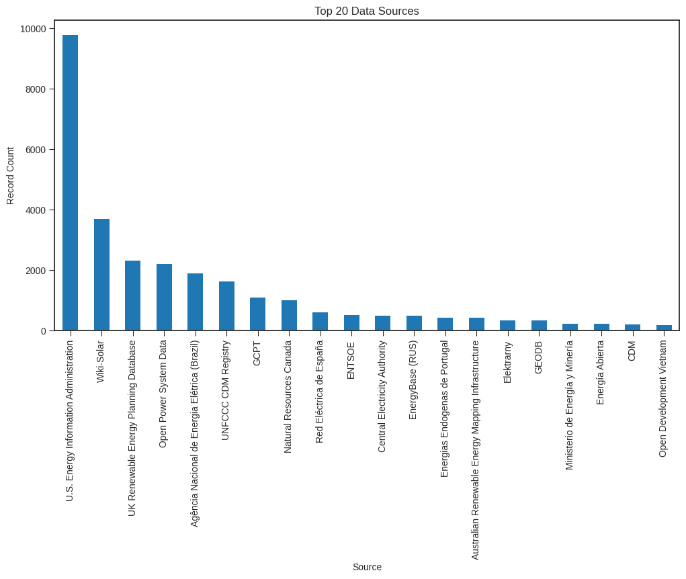

## Summary of Results and Findings

After cleaning and preparing the dataset, the analysis focused on three main areas: the capacity of power plants, the fuel types they use, and how they are distributed across the world.

### Most Power Plants Have Lower Capacities

The distribution of installed capacity was heavily skewed. Most power plants had relatively low or moderate capacities, while a much smaller number of plants had extremely high capacities.

This means that the number of power plants in a country or fuel category does not necessarily represent the amount of electricity it can produce. A region may contain many smaller plants but still have less installed capacity than another region with fewer, much larger plants.

### Capacity Differs Across Fuel Types

The comparison between fuel types showed clear differences in the typical size of power plants.

Nuclear and coal plants generally had higher installed capacities. Solar, wind, biomass, geothermal, storage, waste and cogeneration plants were mostly concentrated at lower capacities. Hydro plants had a wider range, containing both small facilities and some of the largest plants in the dataset.

This shows that the type of fuel used is closely related to the scale at which a power plant is normally built.

### Higher Capacity Generally Results in Higher Generation

The relationship between installed capacity and electricity generation was generally positive. Plants with higher capacities tended to generate more electricity.

However, the relationship was not exact. Some high-capacity plants still had lower generation values than expected. This suggests that capacity is important, but other factors such as fuel type, plant age, operating time, maintenance and demand may also affect the amount of electricity generated.

### Power Plants Are Not Evenly Distributed

The geographical analysis showed that power plants are spread across the world, but their distribution is not even.

Large clusters appeared in North America, Europe and Asia, particularly around the United States, China, India, Japan and parts of Southeast Asia. High-capacity plants were also found across several regions rather than being limited to one country or continent.

Parts of Africa and South America appeared to contain fewer recorded plants. This may reflect actual differences in energy infrastructure, but it may also be affected by differences in reporting and data availability.

### Some Countries Are More Strongly Represented

The United States had the largest number of power plant records in the dataset, followed by countries such as China and the United Kingdom.

However, these values represent the number of recorded plants rather than their total capacity or electricity generation. A country with fewer records may still have a large power system if its plants have higher individual capacities.

### The Dataset Is Influenced by Its Data Sources

A large number of records came from organisations such as the U.S. Energy Information Administration, Wiki-Solar and the UK Renewable Energy Planning Database.

This is important when interpreting the results because some countries, technologies and types of power plants may be documented more thoroughly than others. Therefore, some of the patterns found in the analysis may reflect both real differences in global power infrastructure and differences in how the data was collected.

## Conclusion

The analysis shows that global power infrastructure cannot be understood by simply counting the number of power plants. Most plants in the dataset have relatively low capacities, while a smaller number of very large plants account for the upper end of the distribution.

Fuel type was also related to the scale of the plants. Nuclear and coal plants were generally larger, while technologies such as solar and wind appeared more frequently at lower capacities. Higher-capacity plants also tended to generate more electricity, although capacity alone did not fully explain generation output.

The geographical results showed clear concentrations of power plants across North America, Europe and Asia. However, the analysis also showed that the dataset is affected by differences in reporting and source coverage. For this reason, the results provide a useful view of global power infrastructure, but they should not be treated as a complete measurement of every country's energy system.

Overall, the project demonstrates how a large and incomplete dataset can be cleaned, explored and turned into useful insights about power plant capacity, fuel type, electricity generation and geographical distribution.
